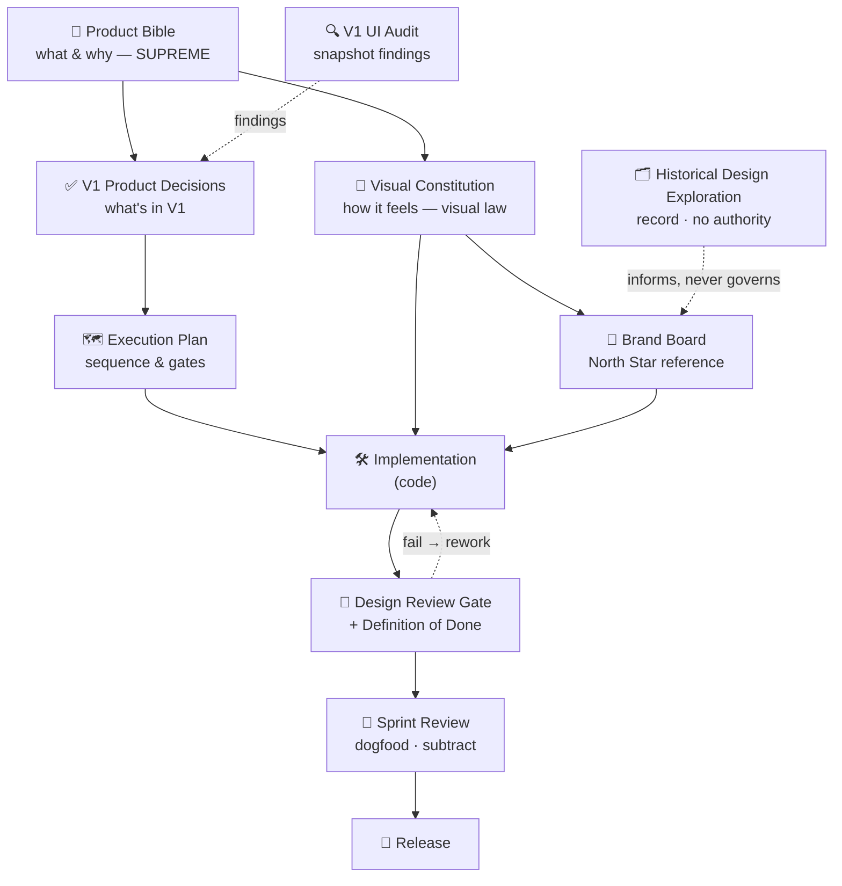

# 🏛️ Plant Daddy HQ — Design Governance

**How every design and product document relates, and how design decisions are made.**
This is the map to the other maps. If you read only one file before touching the UI, read this — it tells you which documents have authority, in what order, and the exact path a change walks before it ships.

> **Purpose.** One year from now, a new contributor (or future-us) should open this file and immediately understand *where authority comes from* and *how a decision becomes a shipped pixel* — with no tribal knowledge required. Governance is what keeps the app from drifting as hands and time change.

---

## 1. Document Hierarchy

Every governing document, what it is for, and its limits. Two tiers: **Constitutional** (the laws — change rarely, deliberately) and **Instrumental** (the tools that apply the laws — change often).

### Constitutional documents (authority)

**Product Bible** — `docs/Plant-Daddy-HQ-Product-Bible.md`
- *Why it exists:* defines what Plant Daddy HQ **is**, who it's for, and why — product truth, values, scope, and the non-negotiables (privacy, honesty, data safety, accessibility as a release gate).
- *Authority:* **supreme.** It sets the boundaries every other document operates within.
- *Does NOT control:* how things *look or feel* (that's the Visual Constitution), or *when/how* work is sequenced (that's the Execution Plan).
- *Who references it:* everyone, before proposing any feature or change.
- *When updated:* rarely and deliberately, when a founding decision genuinely changes. Change it *here first*, then let it flow down.

**Visual Constitution** — `docs/VISUAL-CONSTITUTION.md`
- *Why it exists:* defines how the app must **look, feel, and be crafted** — the philosophy beneath every visual decision, and the Design Review Gate that enforces it.
- *Authority:* **supreme over all visual/experiential decisions**, within the Product Bible's boundaries.
- *Does NOT control:* what features exist or product strategy (Bible), or component-level pixel specs (those live in code + the Brand Board).
- *Who references it:* anyone touching UI, illustration, color, type, motion, or interaction.
- *When updated:* rarely and deliberately — it is a constitution, not a changelog. Amendments are considered, not casual.

**Brand Board** — `design/brand-board.html`
- *Why it exists:* the concrete **visual North Star** — the exact palette, type roles, specimen plate, and component kit the Constitution codifies in words.
- *Authority:* the **canonical visual reference.** When you need the real hex, the real type role, the real plate composition, this is it.
- *Does NOT control:* philosophy or rationale (that's the Constitution) — it shows *what*, the Constitution explains *why*. If the Board and the Constitution ever diverge, the Constitution's reasoning wins and the Board is corrected.
- *Who references it:* designers/implementers needing the concrete target.
- *When updated:* only on a deliberate visual evolution ratified against the Constitution — effectively a mini-rebrand. Not casually.

**Historical Design Exploration** — `design/design-comparison.html` (formerly "Design Direction Review")
- *Why it exists:* the **record of the option-finding phase** — the AI render studies that led to the locked direction.
- *Authority:* **none.** It is history, not law.
- *Does NOT control:* anything. It informs and inspires; it never governs. Its AI renders are aspirational mockups with fake text — never literal UI specs.
- *Who references it:* anyone wanting to understand *why* we chose this direction, or seeking mood reference for the V2 watercolor portrait plates.
- *When updated:* **never.** A historical record is preserved as-is; see §6.

### Instrumental documents (application)

**V1 UI Audit** — `docs/V1-UI-Audit.md`
- *Why:* a point-in-time assessment of the built UI against the Bible + Constitution.
- *Authority:* advisory — findings feed decisions; it does not itself decide.
- *Does NOT control:* final scope (that's Product Decisions). It reports; it doesn't rule.
- *Who references it:* whoever is deciding what to fix.
- *When updated:* superseded by a fresh audit; a given audit is a dated snapshot, not a living doc.

**V1 Product Decisions** — `docs/V1-Product-Decisions.md`
- *Why:* the record of *what we chose to build in V1 and why* (accept/reject/modify against the audit + Bible).
- *Authority:* binding for V1 scope, downstream of the Bible.
- *Does NOT control:* how it looks (Constitution) or the build order (Execution Plan).
- *Who references it:* anyone asking "is this in V1?"
- *When updated:* append-only as decisions evolve; each decision is dated and reasoned.

**Execution Plan** — `docs/V1-Execution-Plan.md`
- *Why:* sequences the approved work into sprints with effort, risk, dependencies, and gates.
- *Authority:* binding for *order and process*; it obeys the Bible, Constitution, and Decisions.
- *Does NOT control:* what's true, what looks right, or what's in scope — only *when and how* it's built.
- *Who references it:* whoever is building, to know what's next and what gates apply.
- *When updated:* continuously, as work progresses.

**Definition of Done** — `docs/DEFINITION-OF-DONE.md`
- *Why:* the twelve-gate completion contract every feature must pass.
- *Authority:* binding — nothing is "done" until all gates pass.
- *Does NOT control:* what to build or how it looks; it verifies *completeness and quality*.
- *Who references it:* the implementer at commit/merge time.
- *When updated:* rarely; it's a stable quality bar.

*(Supporting operational files — `BACKLOG.md` (tracker), `WHATS-NEW.md` (changelog), `Houseplant-System-Master-Doc.md` (care-math brain) — are instruments too: they record and organize, they do not set authority.)*

---

## 2. Decision Hierarchy — who wins when documents disagree

**Order of precedence:**

```
Product Bible  >  Visual Constitution  >  Brand Board  >  Historical Design Exploration
   (what/why)        (how it feels)        (the reference)      (no authority)
```

And for execution: **the three laws above** > V1 Product Decisions > Execution Plan > BACKLOG. The Definition of Done and the Design Review Gate are **filters every change passes through**, not competitors in the ranking.

**Why this order:**
- **Product Bible first** because a beautiful thing that betrays the product's truth (privacy, honesty, data safety, accessibility) is still wrong. The Bible's non-negotiables — including *AA as a release gate* — can override a visual preference. Craft serves the product; it never overrules its conscience.
- **Visual Constitution second** because *within* those boundaries, how it feels is not negotiable down by convenience, deadline, or fashion. It outranks the Brand Board because it holds the *reasoning*; the Board is one faithful expression of that reasoning.
- **Brand Board third** because it is the concrete target, but concreteness can go stale; when it and the Constitution diverge, we fix the Board, not bend the philosophy.
- **Historical Exploration last (zero authority)** because past options must never quietly reassert themselves as law. It informs; it cannot decide.

**The productive tension to name honestly:** the Bible and the Constitution mostly govern *different domains* (product vs. visual) and rarely truly conflict. When they seem to — e.g., "accessibility contrast vs. the soft palette" — the resolution is never "pick one." The Constitution is written so accessibility is achieved *through* the aesthetic (darker warm ink, not colder gray). If a real conflict remains, the Bible wins and the Constitution is amended to absorb the constraint gracefully.

---

## 3. Design Evolution Process — how an idea becomes shipped

```
Idea → Exploration → Prototype → Brand Review → Constitution Check
     → Product Decision → Implementation → QA → Release
```

1. **Idea.** A problem or possibility, framed against the Product Bible ("does this serve the intentional keeper?").
2. **Exploration.** Divergent options — sketches, references, AI studies. *Low commitment, wide net.* (This is the phase the Historical Design Exploration came from. New explorations are welcome, but they are *never* governance.)
3. **Prototype.** A concrete, reviewable artifact — a preview page, a mock, a spike (e.g., `a11y.preview.html`). Real enough to judge, cheap enough to throw away.
4. **Brand Review.** Does it belong on the Brand Board? Measured against the North Star.
5. **Constitution Check.** Does it satisfy the Visual Constitution's philosophy — calm, materiality, plant-as-hero, warmth-with-legibility? If it forces a genuine new principle, **amend the Constitution first**, then proceed.
6. **Product Decision.** Is it in scope, now? Recorded in Product Decisions; sequenced in the Execution Plan.
7. **Implementation.** Built to the Brand Board's concrete specs, in code.
8. **QA.** Definition of Done (all twelve gates) + the launch QA checklist.
9. **Release.** Shipped, changelog updated, dogfooded.

Ideas may loop back (a prototype that fails the Constitution returns to exploration). The only forbidden move is skipping straight from *exploration* to *implementation* — that is how drift happens.

---

## 4. Design Review Workflow — the exact path every UI change walks

No UI change ships until it passes all six checkpoints **in order**. A failure at any checkpoint sends it back; it does not proceed on "we'll fix it later."

1. **Product Review** — *(Product Bible)* Does this serve the intentional keeper and the three jobs (Reference/Ritual/Record)? Is it in the V1 scope per Product Decisions? Does it honor the non-negotiables (privacy, honesty, data safety)? → *Pass = it's the right thing.*
2. **Visual Review** — *(Visual Constitution + Brand Board)* Does it match the North Star's palette, type roles, and composition? Is the plant the hero? Is it editorial, not dashboard? → *Pass = it looks right.*
3. **Accessibility Review** — *(Bible §18 gate)* WCAG AA contrast, ≥44px targets, labeled controls, focus states, reduced-motion, no color-only meaning — achieved with *darker warm ink, not gray*. → *Pass = everyone can use it.*
4. **Design Review Gate** — *(Visual Constitution §11, the seven questions)* Calmer? Plant still the hero? Belongs on the Brand Board? Feels like a botanical artifact, not software? No unnecessary chrome? Can anything disappear? Strengthens the botanical identity? → *Pass = it feels like us.*
5. **Definition of Done** — *(DEFINITION-OF-DONE.md, twelve gates)* Code, tests, manual, a11y, responsive, no console warnings, undo, backup intact, docs, changelog, commit, merged. → *Pass = it's actually finished.*
6. **Sprint Review** — *(Execution Plan ritual)* Demo on the real phone, dogfood 2–3 days, record friction, **remove one interaction, fix one annoyance**. → *Pass = it earned its place and the product got simpler.*

**Order matters:** we confirm it's the *right thing* (1) and *looks right* (2–4) before we sweat *done-ness* (5), and we only bless it after *living with it* (6). Accessibility (3) and craft (4) sit side by side on purpose — neither is allowed to sacrifice the other.

---

## 5. Living vs. Enduring Documents

Knowing a document's *cadence* prevents both rot (never updating the trackers) and churn (constantly rewriting the laws).

- **Continuously updated (instruments — expected to change weekly):** `BACKLOG.md`, `V1-Execution-Plan.md`, `WHATS-NEW.md`, and the append-only `V1-Product-Decisions.md`. These are *working memory*; keeping them current is the job.
- **Occasionally, deliberately amended (constitutions — change is an event):** `Product Bible` and `Visual Constitution`. Amended only when a founding truth genuinely shifts, and always *before* the change flows into the build — never retrofitted to justify something already shipped.
- **Rarely changed (stable references):** `DEFINITION-OF-DONE.md` (a stable quality bar) and the `Brand Board` (changes only on a deliberate visual evolution ratified against the Constitution).
- **Frozen (records — never edited):** the `Historical Design Exploration` and any dated `V1 UI Audit` snapshot. A record's value *is* its fixedness; you supersede it with a new document, you don't rewrite it.

Rule of thumb: **the higher a document's authority, the slower it should change.** Laws move like glaciers; trackers move like tides.

---

## 6. Historical Preservation

The former "Design Direction Review" is now titled **Historical Design Exploration** (`design/design-comparison.html`, retitled in place; the uploaded PDF is the same artifact). **It is preserved, not archived** — it stays in the repo, linked and viewable, with a banner marking it as reference-only.

**Why it remains valuable while holding no authority:**
- **It records the "why."** It shows the options we weighed and rejected, so future contributors understand *how* we arrived at the Botanist's Field Journal — preventing re-litigation of settled questions.
- **It's a mood library.** Its AI watercolor renders are the closest visual target for the **V2 portrait plates**; we'll mine them for the illustration ceiling.
- **It's an honesty artifact.** It documents that the direction was *chosen*, not assumed — and that the renders were aspirational (with fake text), which is exactly why they can't be specs.

**Why "preserve, not archive":** archiving hides history; a governance system should keep its reasoning *visible* so decisions stay legible. We remove its *authority*, not its *presence*. The banner and this document ensure no one mistakes inspiration for law.

---

## 7. Governance Diagram

How every document flows into a shipped change:



**Authority, top-down (who bounds whom):**

```
        ┌──────────────────────────┐
        │      PRODUCT BIBLE        │   what is true / required  (supreme)
        └────────────┬─────────────┘
                     │ bounds
        ┌────────────▼─────────────┐
        │    VISUAL CONSTITUTION    │   how it must feel  (visual law)
        └────────────┬─────────────┘
                     │ codified by
        ┌────────────▼─────────────┐
        │        BRAND BOARD        │   the concrete North Star
        └────────────┬─────────────┘
                     │ chosen from
        ┌────────────▼─────────────┐
        │  HISTORICAL EXPLORATION   │   record only · no authority
        └──────────────────────────┘

   Instruments that apply the laws (not authorities):
   UI Audit → Product Decisions → Execution Plan → [ Design Review Gate + Definition of Done + Sprint Review ] → Release
```

---

*Plant Daddy HQ — Design Governance v1. The map to the maps. Authority flows down; work flows through the gates; history is preserved but never rules. Read this first, then build with confidence.*
